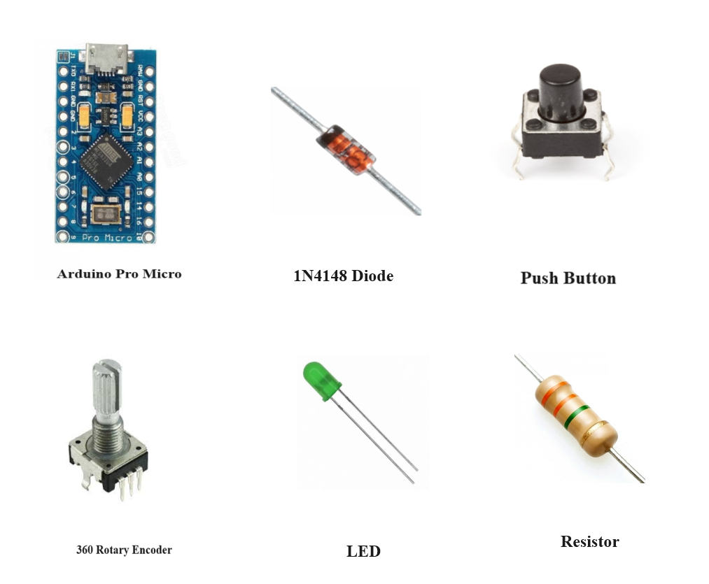
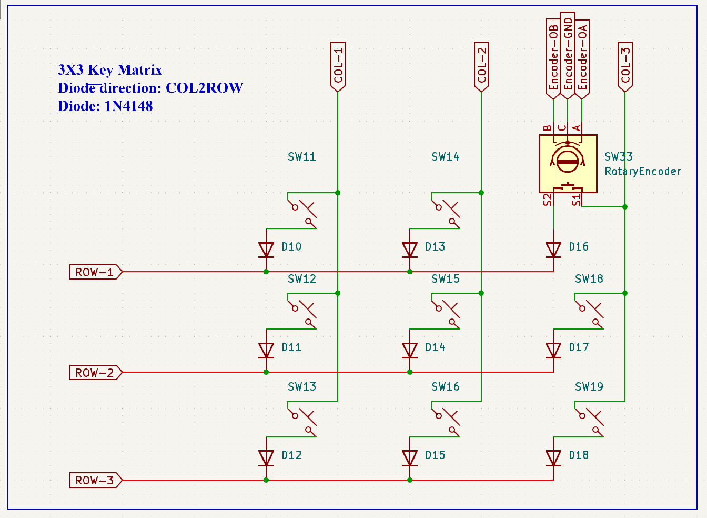
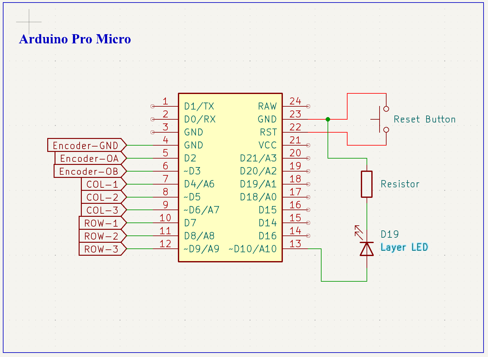

# 3X3 Macropad with Arduino Pro Micro and QMK Firmware

A rotary encoder is included in this 3X3 macropad.  Every key has a unique set of functions. The macropad is built with an Arduino which is operating using <a href="https://github.com/qmk/qmk_firmware">QMK Firmware.</a> 

## Component List

1. Arduino Pro Micro  
2. Push Buttons  
3. 1N4148 Diode  
4. 360 Rotary Encoder  
5. LED  
6. Resistor

 

## 3X3 Key Matrix Schematic

 To lower the pin count, every switch is connected in a matrix. Every switch uses a switching diode (1N4148) to prevent conflicts. 

 

 

## Arduino Connection Schematic

 Pins of ROWs, COLs and Encoder is connected to Arduino. Additionally, there is a linked LED that shows whether the second layer of the macropad is on or off. To flash the firmware the reset switch will be needed. 

 

